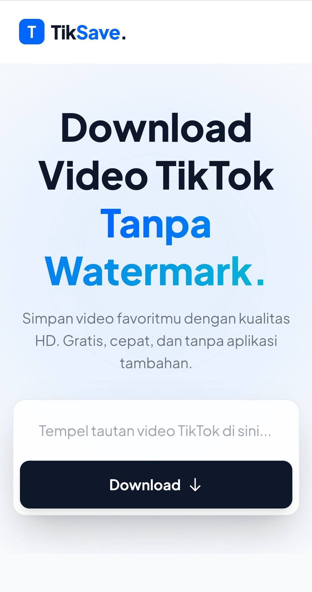

<div align="center">
  
  <p>
    <b>The Modern TikTok Video Downloader (No Watermark)</b>
  </p>

  <p>
    <a href="https://github.com/oziy-id/tiktok-downloader-flask/graphs/contributors">
      
    </a>
    <a href="">
      
    </a>
    <a href="https://github.com/oziy-id/tiktok-downloader-flask/network/members">
      
    </a>
    <a href="https://github.com/oziy-id/tiktok-downloader-flask/stargazers">
      
    </a>
    <a href="https://github.com/oziy-id/tiktok-downloader-flask/issues/">
      
    </a>
    <a href="https://github.com/oziy-id/tiktok-downloader-flask/blob/master/LICENSE">
      
    </a>
  </p>
   
  <h4>
    <a href="https://oziy-id-tik-save.hf.space">🟢 View Live</a>
    <span> · </span>
    <a href="https://github.com/oziy-id/tiktok-downloader-flask/issues/">🐞 Report Bug</a>
    <span> · </span>
    <a href="https://github.com/oziy-id/tiktok-downloader-flask/issues/">✨ Request Feature</a>
  </h4>
</div>

<br />



## 📝 About The Project

**TikSave Premium** adalah aplikasi web modern untuk mengunduh video TikTok tanpa watermark. Dibangun dengan fokus pada kecepatan, desain UI yang elegan (Glassmorphism), dan keandalan sistem.

Berbeda dengan downloader biasa, TikSave menggunakan metode **Smart Proxy & User-Agent Spoofing** untuk menembus proteksi anti-bot TikTok, sehingga unduhan tetap stabil tanpa error 403.

### ✨ Key Features

* 🚫 **No Watermark:** Download video bersih kualitas HD.
* 🚀 **Fast & Reliable:** Menggunakan `yt-dlp` engine yang powerfull.
* 🛡️ **Anti-Block System:** Dilengkapi headers manipulasi untuk menghindari error 403 Forbidden.
* 🎨 **Modern UI:** Tampilan Glassmorphism kekinian dengan Tailwind CSS.
* 📱 **Responsive:** Tampilan sempurna di Desktop & Mobile.
* 🐳 **Docker Ready:** Siap dideploy di mana saja (Hugging Face, VPS, Railway).

---

## 🛠️ Tech Stack

Dibuat dengan cinta menggunakan teknologi open-source:

*  **Backend Framework**
*  **Core Logic**
*  **Styling**
*  **Containerization**
* **yt-dlp** - The magic behind video extraction.

---

## ⚡ Getting Started

Ingin menjalankan project ini di komputermu? Ikuti langkah mudah ini.

### Prerequisites

* Python 3.8+
* Git

### Installation

1.  **Clone repo ini**
    ```bash
    git clone [https://github.com/oziy-id/tiktok-downloader-flask.git](https://github.com/oziy-id/tiktok-downloader-flask.git)
    cd tiktok-downloader-flask
    ```

2.  **Install Dependencies**
    ```bash
    pip install -r requirements.txt
    ```

3.  **Jalankan Server**
    ```bash
    python app.py
    ```

4.  **Buka Browser**
    Akses `http://localhost:5000` dan nikmati!

---

## 🐳 Docker Deployment (Recommended)

Project ini sudah dikonfigurasi untuk Docker. Sangat cocok untuk deployment di Hugging Face Spaces.

1.  **Build Image**
    ```bash
    docker build -t tiksave .
    ```

2.  **Run Container**
    ```bash
    docker run -p 7860:7860 tiksave
    ```

---

## 🤝 Contributing

Kontribusi sangat diterima! Jika kamu punya ide fitur baru atau perbaikan bug:

1.  Fork project ini
2.  Buat branch fitur baru (`git checkout -b fitur-keren`)
3.  Commit perubahanmu (`git commit -m 'Menambahkan fitur keren'`)
4.  Push ke branch (`git push origin fitur-keren`)
5.  Buat Pull Request

---

## 👤 Author

**Oziy ID**

* Github: [@oziy-id](https://github.com/oziy-id)
* Instagram: [@oziy.id](https://instagram.com/oziy.id)

---

<div align="center">
    <p>Don't forget to star ⭐ this repository if you find it useful!</p>
</div>

